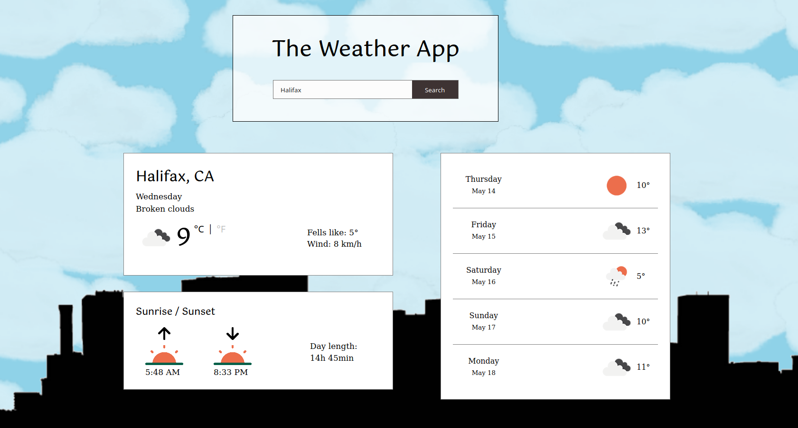

# The Weather App

The weather app allows a user to search weather information for a specific location. With the use of the Open Weather API, the app provides the following information:

- Current temperature;
- Weather condition;
- Wind speed;
- Fells-like temperature;
- Sunrise and sunset time;
- Day length;
- Forecast temperature for the next five days.

The user can also switch between metric and imperial units.

## Built With

- HTML5; 
- CSS3;
- JavaScript;
- NPM;
- Webpack;
- Open Weather API.

## Preview

## Live Demo

[Live Demo Link]()

## Getting Started

Download or clone the project [here](https://github.com/bruna-genz/weather-app.git), then enter in the project's directory from the terminal and run the following comands:
- `npm i`
- `npm run start`

## Author

:woman: **Bruna Genz**

- Github: [@bruna-genz](https://github.com/bruna-genz)
- Twitter: [@Bruna_GK](https://twitter.com/Bruna_GK)
- Linkedin: [Bruna Genz](https://www.linkedin.com/in/brunagenz/)

## 🤝 Contributing

Contributions, issues and feature requests are welcome!

## Show your support

Give a ⭐️ if you like this project!
