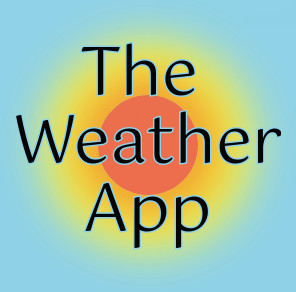

<h1 align="center">
   
  
</h1>

<h4 align="center"><a href="https://weather-app-by-bruna.netlify.app/">Live version >></a></h4>

## Table of Contents

- [About](https://github.com/bruna-genz/weather-app#built-with)
- [Preview](https://github.com/bruna-genz/weather-app#preview)
- [Built with](https://github.com/bruna-genz/weather-app#built-with)
- [Installation](https://github.com/bruna-genz/weather-app#installation)
    - [Online version](https://github.com/bruna-genz/weather-app#online-version)
    - [Local version](https://github.com/bruna-genz/weather-app#local-version)
- [Author](https://github.com/bruna-genz/weather-app#author)
- [Show your support](https://github.com/bruna-genz/weather-app#show-your-support)

## About

The weather app allows a user to search for weather information for a specific location. With the use of the Open Weather API, the app provides the following information:

- Current temperature;
- Weather condition;
- Wind speed;
- Fells-like temperature;
- Sunrise and sunset time;
- Day length;
- Forecast temperature for the next five days.

The user can switch between metric and imperial units by clicking on the desired unit symbol (°C or °F).

## Preview

## Built With

- HTML5; 
- CSS3;
- JavaScript;
- npm;
- Webpack;
- Open Weather API.

## Installation

- ### Online version:

Just access this [link](https://weather-app-by-bruna.netlify.app/) and type the city name on the input to get the current temperature and weather forecast for the next five days.

- ### Local version:

To install a local version of this app, download or clone the project [here](https://github.com/bruna-genz/weather-app.git), then enter in the project's directory from the terminal and run the following commands:
- `npm i`
- `npm run start`

## Author

:woman: **Bruna Genz**

- Github: [@bruna-genz](https://github.com/bruna-genz)
- Twitter: [@Bruna_GK](https://twitter.com/Bruna_GK)
- Linkedin: [Bruna Genz](https://www.linkedin.com/in/brunagenz/)
- Email: brunagenz92@gmail.com

## Show your support

Give a ⭐️ if you like this project!
